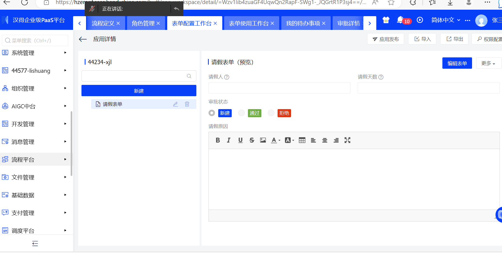
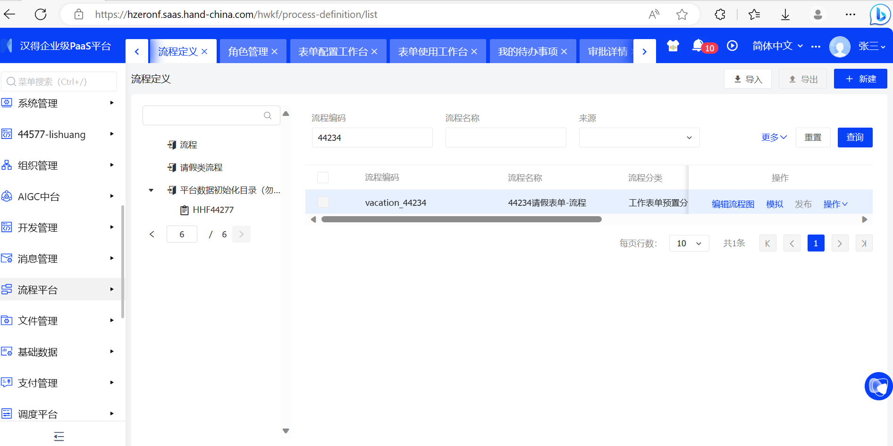
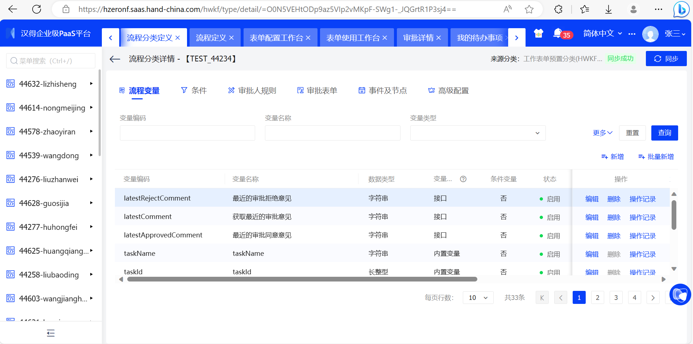
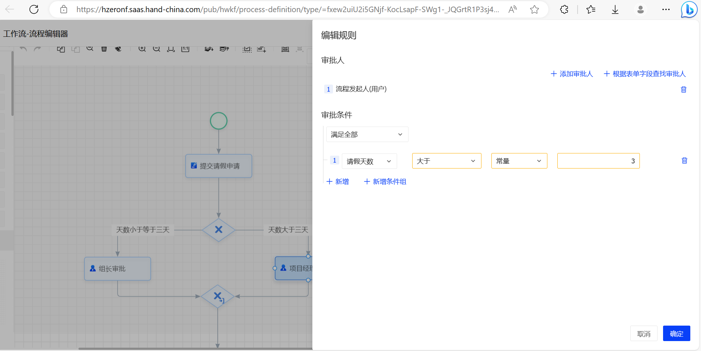
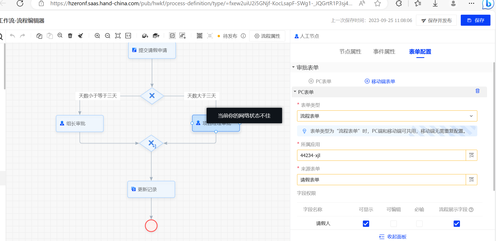
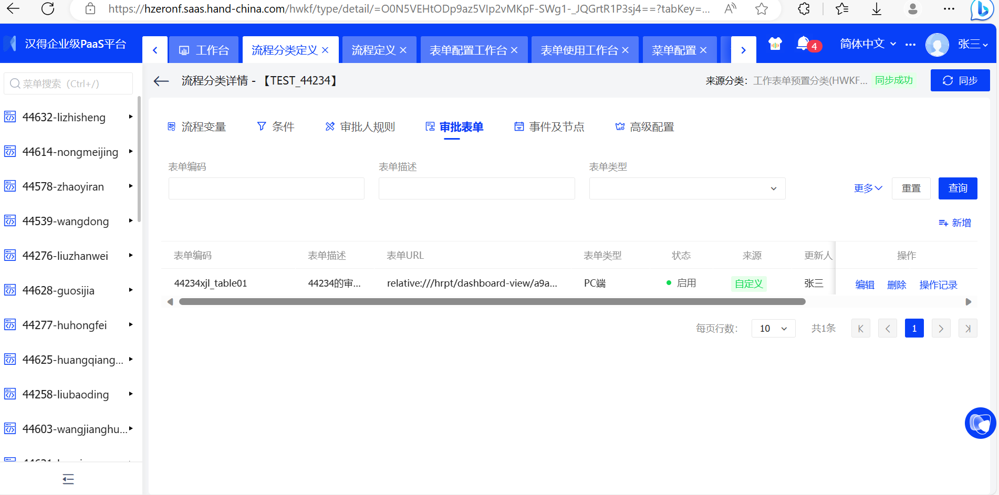
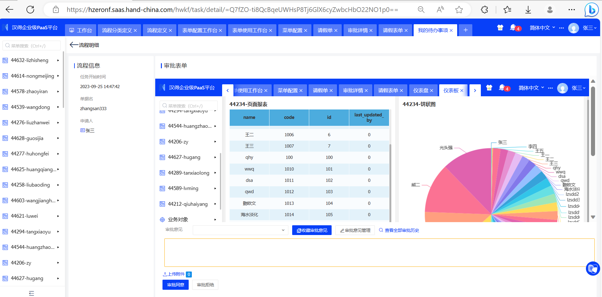
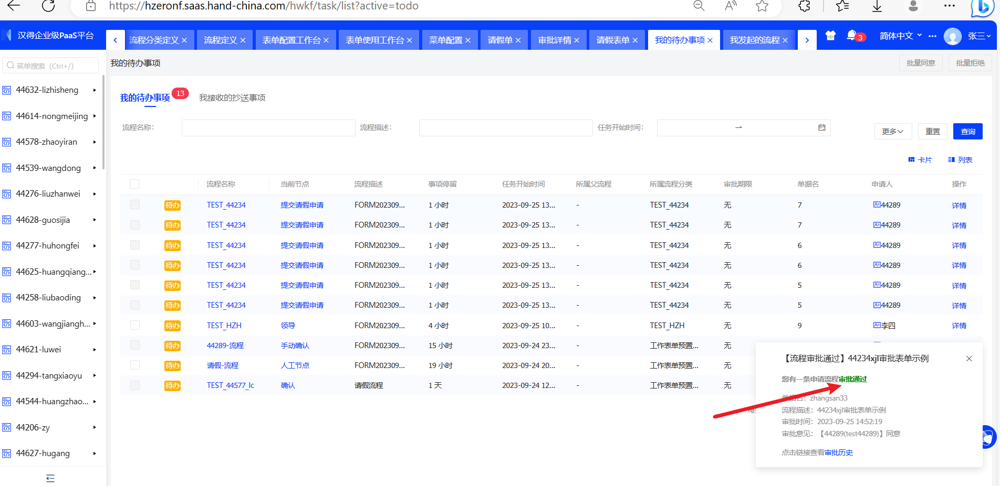

10、流程平台

### 1）配置流程表单、流程定义、流程变量、审批人规则、审批表单

- #### 流程表单、

- #### 流程定义、

- #### 流程变量、

- #### 审批人规则：默认采用发起流程用户进行审批

- #### 审批表单

  

### 2）截图展示录入数据、待办审批、审批完成、修改表单单据状态(gif，网有点卡）

### 3）将报表平台配置的页面，或者仪表板页面作为审批表单，挂到流程里，并且能够加载出来，完成流程审批动作。

- #### 审批表单设置：

- #### 具体显示和结果

