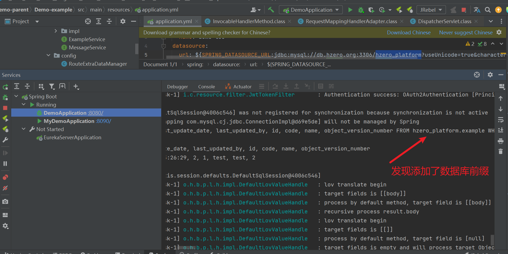

### 1）租户、角色、菜单、子账户、API权限集

- #### 租户

- #### 角色

- #### 菜单

  

- #### 子账户

- #### API权限集:为新创建的租户分配api

### 2）值集配置、值集视图培训、可以预览LOV效果

- #### 值集配置:为版本号新建一个固定值集

- #### 值集视图培训：这里以sql值集为例

- #### 值集视图

- #### 预览效果:

### 3）编码规则配置，通过代码可以生成编码规则值

- #### 新建编码规则，编码字段为UUID

- #### 编码规则代码实现：

- #### swagger测试接口：

### 4）配置维护界面，通过代码可以获取配置维护的值

- #### 新建配置：

- #### 代码实现：未完成

### 5）客户端创建、通过postman测试使用客户端获取token，并调用API接口

- #### 客户端创建：

- #### 获取token

  

### 6）数据权限规则、权限范围设置。调用API接口查看权限规则是否生效，可通过debug模式打印sql

- #### 数据权限规则：默认为指定表增加数据库前缀

  

- #### 权限范围设置：指定表为example,添加前缀

- #### 代码日志：调用接口，查看打印日志

  