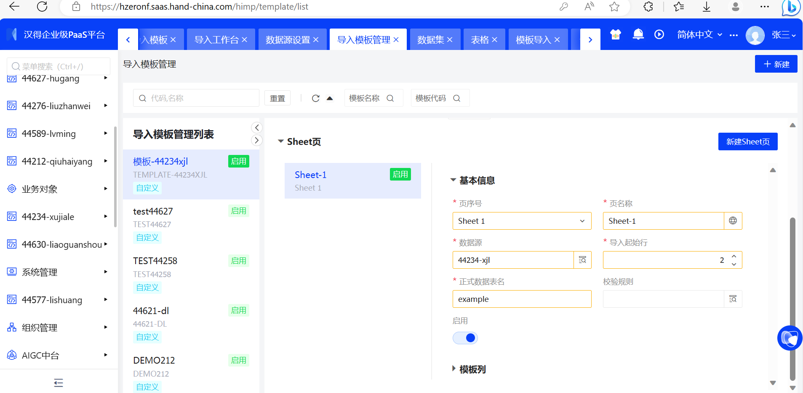
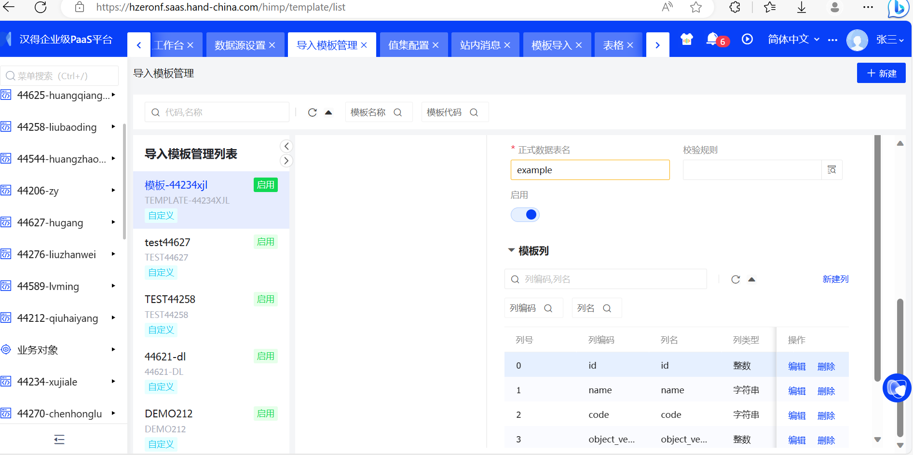
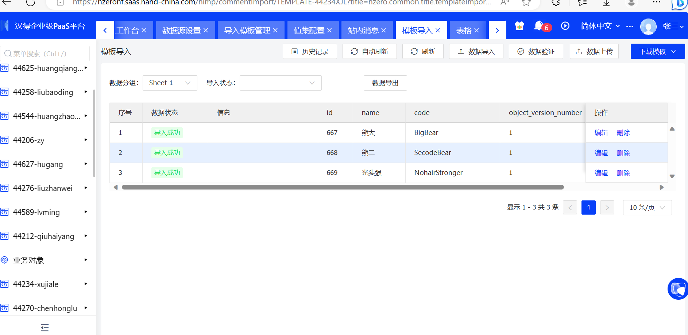
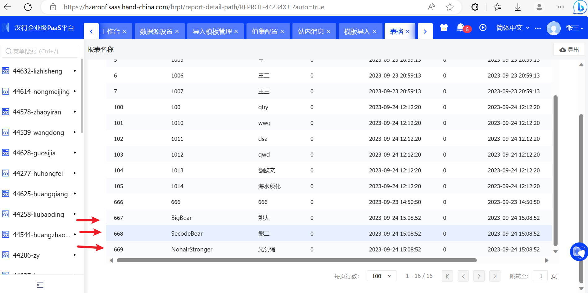

### 

### 1）配置导入模板

### 2）模板类型=客户端时，引入通用导入客户端，通过代码实现自定义校验、自定义导入逻辑（注册不上服务器，导入不了）

### 3）模板类型=服务端时，直接导入数据到表里。----可导入国家、币种等信息：对应example数据表没有相应国家，币种等字段，只能导入code，name等基础字段

- #### 导入模板

- #### 数据导入

- #### 导入后的数据表：

