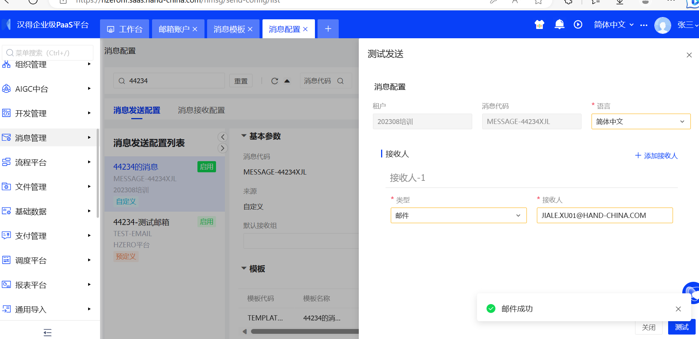

7、消息管理：

### 1）配置邮箱账户、消息模板、消息发送配置；测试发送消息给自己的邮箱

- #### 邮箱账户配置:这里配置的是自己的163邮箱，向自己的企业微信发邮件

  

- #### 消息模板配置

- #### 消息发送及接收

  

### 2）引入消息服务客户端，通过代码调用消息服务客户端，根据消息代码发送；根据消息类型+账号发送消息

- #### 服务端代码编写：无法注册到远程服务上

