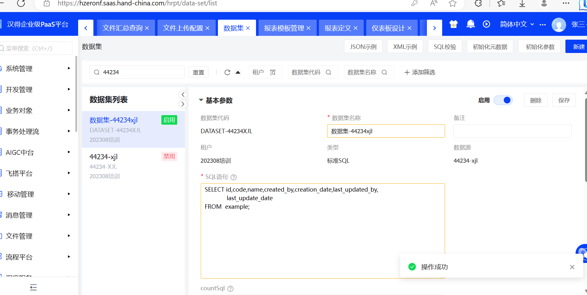
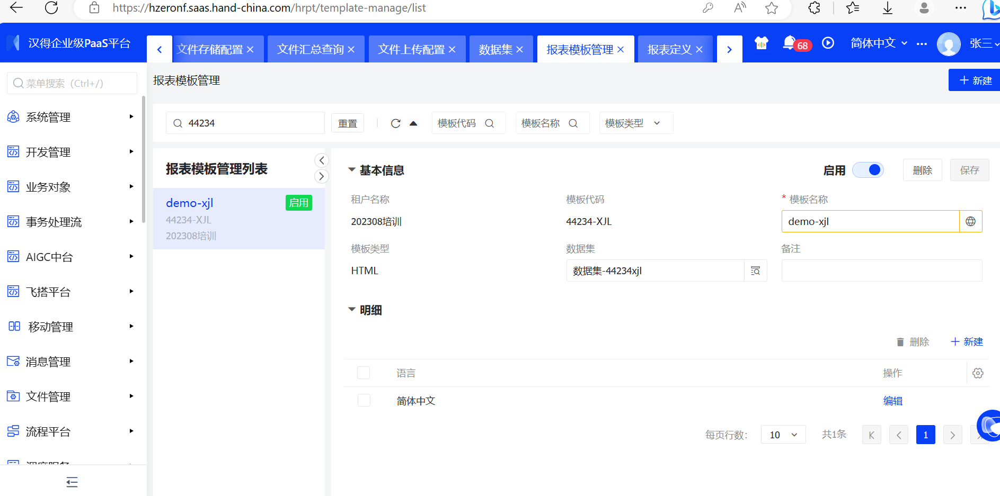
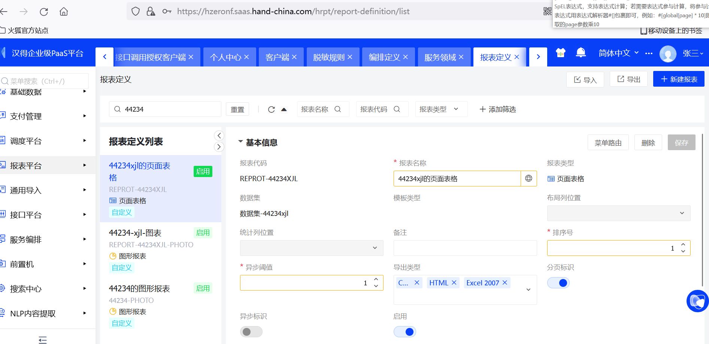
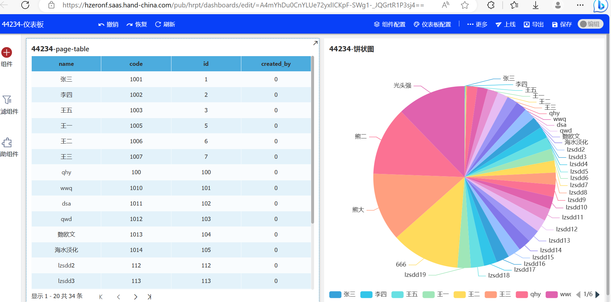
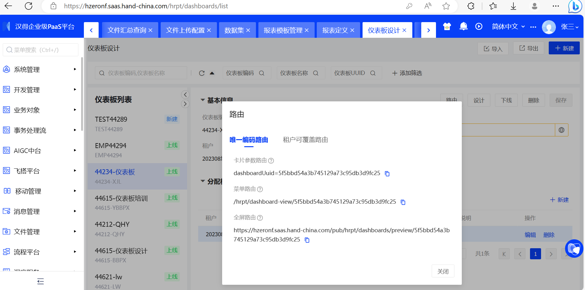
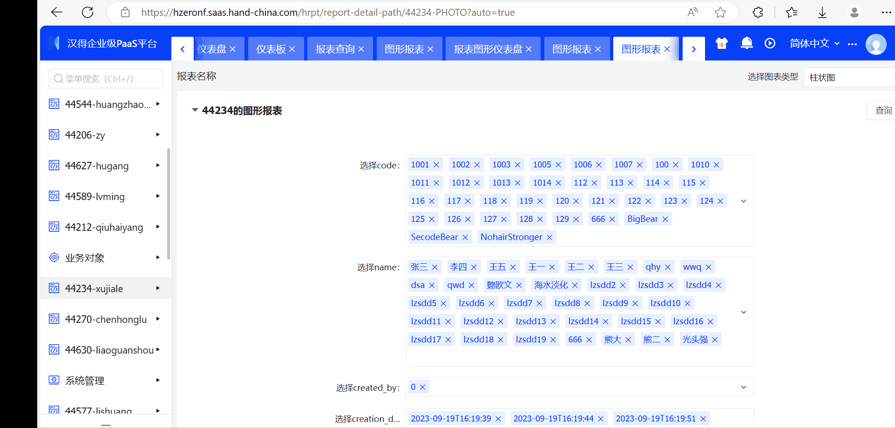

9、报表平台：

### 1）配置数据集、报表模板管理、报表定义

- ### 数据集

#### 报表模板管理

- #### 报表定义

  

### 2）配置仪表板（简单表格、饼状图），发布成路由

- #### 仪表板

- #### 路由

  

### 3）到培训租户下，以“工号-姓名”创建一级目录，将页面表格、图形报表、仪表板路由挂到菜单上：具体操作gif

### 